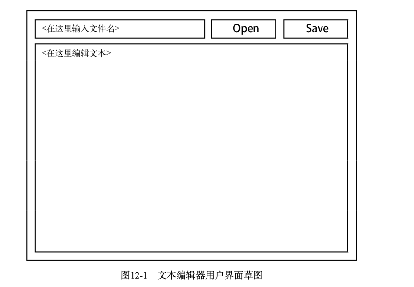
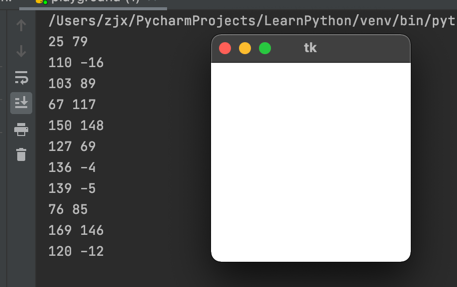

# 12 图形用户界面
本章主要使用Tkinter，它是Python标准GUI工具包
## 12.1 创建GUI示例应用程序
需要实现的需求：
+ 让用户可以打开指定的文件
+ 让用户能够编辑文件
+ 让用户能保存文件
+ 让用户能够退出

一般编写GUI程序都需要画一下草图，比如：


### 12.1.1 初探
首先得导入模块Tkinter`import tkinter as tk`在这里为了方便直接`from tkinter import *`  
下面的操作都是在交互式Python解释器中执行的  
要创建GUI，可创建一个将充当主窗口的顶级组件(控件)。为此，可实例化一个Tk对象。
```python
from tkinter import *
top = Tk()
```
此时在mac上，Python会启动，但是一直是启动中的状态，直到输入了下面的语句，进入到主事件循环，Python才启动起来，同时出现
一个窗口
```python
mainloop()
```
此时解释器像是挂起了，而GUI还在运行。  

tkinter有很多可用的控件，比如按钮，可以实例化Button类。如果没有Tk实例，创建控件也将实例化Tk，所以可以直接创建控件。
```python
from tkinter import *
btn = Button()
```
此时创建出来的按钮是不可见的，需要通过布局管理器来告诉Tkinter将它放在什么地方。
我们将使用管理器pack——在最简单的情况下只需调用方法pack即可
```python
btn.pack()
```
控件包含各种属性，可以通过它们来修改控件的**外观和行为**。可以像访问字典项一样，访问属性。
```python
# 给按钮添加文本
btn['text'] = 'Click me!'

# 给按钮添加行为
def clicked():
    print('I was clicked')
    
btn['command'] = clicked
```
给控件设置属性还可以使用方法config或在构造函数中配置
```python
# 使用config方法
btn.config(text='Click me!', command=clicked)

# 在构造函数中配置
Button(text='Click me', command=clicked).pack()
```
### 12.1.2 布局
对控件调用`pack`方法时，将把控件放到其父控件（主控件）中。要指定主控件，可以使用构造函数的第一个可选参数；
如果没有指定，将把顶级主窗口作为主控件。
```python
Label(text="I'm in the first window!").pack()

# Toplevel类表示除主窗口外的另一个顶级窗口，而Label就是文本标签。
second = TopLevel()
Label(second, text="I'm in the second window!").pack()
```
没有提供任何参数时，pack从窗口顶部开始将控件堆叠成一列，并让它们在窗口中水平居中。
例如，下面的代码生成一个又高又窄的窗口，其中包含一列按钮:
```python
from tkinter import *
for i in range(10):
    Button(text=i, background='black').pack()
```
还有很多属性可以控制控件的位置和拉伸方式。  
要指定将控件停靠在哪一条边上，可将参数side设置为 LEFT、RIGHT、TOP或BOTTOM。  
要让控件在x或y方向上填满分配给它的空间，可将参数fill设置为X、 Y或BOTH。  
要让控件随父控件(这里是窗口)一起增大，可将参数expand设置为True。  
还有其他的选项，如指定锚点和内边距的选项。  
可以通过help命令查看`help(Pack.config)`

还有其他的布局管理器，具体地说是grid和place，它们可能更能满足你的需求。与pack布局 管理器一样，要使用它们，可对控件调用方法grid和place。为避免麻烦，在一个容器(如窗口) 中应只使用一种布局管理器。

方法grid让你能够这样排列控件:将它们放在不可见的表格单元格中。为此需要指定参数row 和column，还可能要指定参数rowspan或columnspan——如果控件横跨多行或多列。  
方法place让 你能够手工放置控件——通过指定控件的x和y坐标以及高度和宽度来做到。  
也可以通过help命令查看
```python
help(Grid.configure)
help(Place.config)
```
### 12.2.3 事件处理
通过属性command给按钮指定动作，是一种特殊的时间处理。Tkinter还提供了更通用的事件处理机制：方法bind。
要让控件对特定的事件进行处理，可对其调用方法bind，并指定事件的名称和要使用的函数。
```python
from tkinter import *
top = Tk()
def callback(event):
    print(event.x, event.y)

top.bind('<Button-1>', callback)
mainloop()
```
每当点击鼠标左键，会向callback传递一个event对象，这个对象包含的属性随事件类型而异。
例如，对于鼠标单击事件，它提供了x和y坐标，在这个示例中将它们打印出来了。

还有很多其他类型的事件，完整的清单可使用下面的命令来获取:
```python
help(Tk.bind)
```

### 12.1.4 最终的程序
```python
from tkinter import *
from tkinter.scrolledtext import ScrolledText


def load():
    with open(filename.get()) as file:
        # 1.0指定第一行第0个字符，（也就是第一个字符前面）
        # 使用END 来指定文本末尾
        contents.delete('1.0', END)
        contents.insert(INSERT, file.read())


def save():
    with open(filename.get(), 'w') as file:
        file.write(contents.get('1.0', END))


top = Tk()
top.title("Simple Editor")

contents = ScrolledText()
# 调用pack时布局
contents.pack(side=BOTTOM, expand=True, fill=BOTH)

filename = Entry()
filename.pack(side=LEFT, expand=True, fill=X)

Button(text = 'Open', command=load).pack(side = LEFT)
Button(text = 'Save', command=save).pack(side = LEFT)

mainloop()
```