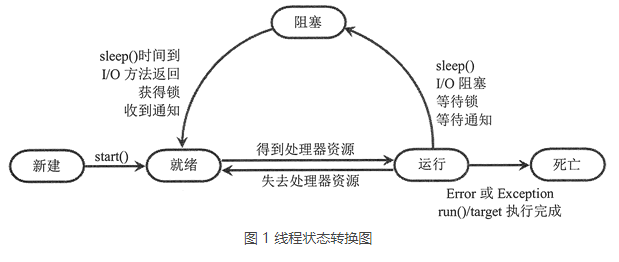

# Python线程的生命周期
当程序中包含多个线程的时候，每个线程轮流执行。  
线程从创建到消亡的整个过程，可能经历5种状态，分别是新建、就绪、运行、阻塞和死亡。

## 线程的新建和就绪状态
通过Thread类实例化或继承Thread类的子类实例化创建的线程，在调用start()方法之前，都不会执行，此时的状态就是新建。
> 只有当线程刚刚创建，且未调用 start() 方法时，该线程才处于新建状态，而一旦线程调用 start() 方法之后，线程将无法再回到新建状态。

调用start()方法之后，线程变成了就绪状态，就是此时CPU可以调度这个线程去执行了。并不是说调用start()方法之后线程会立即执行。

start()方法只能由处于新建状态的线程调用。而且调用之后变成就绪状态，所以只能调用start()方法一次。多次调用会抛出`RuntimeError`

## 线程的运行和阻塞状态
当位于就绪状态的线程得到了 CPU，并开始执行 target 参数执行的目标函数或者 run() 方法，就表明当前线程处于运行状态。

但是线程不可能一直占用CPU，当其他线程占用CPU的时候，那些没能执行完成的线程处于阻塞状态。
> 目前几乎所有的桌面和服务器操作系统，都采用的是抢占式优先级调度策略。即 CPU 会给每一个就绪线程一段固定时间来处理任务，当该时间用完后，系统就会阻止该线程继续使用 CPU 资源，让其他线程获得执行的机会。而对于具体选择那个线程上 CPU，不同的平台采用不同的算法，比如先进先出算法（FIFO）、时间片轮转算法、优先级算法等，每种算法各有优缺点，适用于不同的场景。

还有几种情况会由运行状态转到阻塞状态：
+ 线程调用了sleep()方法
+ 线程等待接收用户输入的数据
+ 线程试图获取某个对象的同步锁（后续章节会详细讲解）时，如果该锁被其他线程所持有，则当前线程进入阻塞状态；
+ 线程调用 wait() 方法，等待特定条件的满足；

以上几种情况都会导致线程阻塞，只有解决了线程遇到的问题之后，该线程才会有阻塞状态转到就绪状态，继续等待 CPU 调度。以上 4 种可能发生线程阻塞的情况，解决措施分别如下：
+ sleep() 方法规定的时间已过；
+ 线程接收到了用户输入的数据；
+ 其他线程释放了该同步锁，并由该线程获得；
+ 调用 set() 方法发出通知；

## 线程死亡状态
对于获得 CPU 调度却未执行完毕的线程，它会转入阻塞状态，待条件成熟之后继续转入就绪状态，重复争取 CPU 资源，直到其执行结束。执行结束的线程将处于死亡状态。
> 线程执行结束，除了正常执行结束外，如果程序执行过程发生异常（Exception）或者错误（Error），线程也会进入死亡状态。

对于处于死亡状态的线程，有以下 2 点需要注意：
+ 主线程死亡，并不意味着所有线程全部死亡。也就是说，主线程的死亡，不会影响子线程继续执行；反之也是如此。
+ 对于死亡的线程，无法再调用 start() 方法使其重新启动，否则 Python 解释器将抛出 RuntimeError 异常。