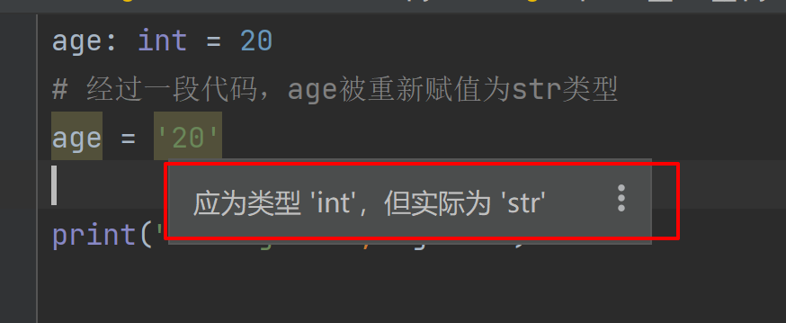

# Python类型注解，你需要知道的都在这里了
参考链接：https://www.dusaiphoto.com/article/164/

通常我们在Python中定义的函数都像这样：

```python
def say(name):
    return f'Hello {name}!'
```

但是，有时候我们会看到这样的代码

```python
def say_hi(name: str) -> str:
    return f'Hi {name}'
```

函数定义似乎变得复杂些了：多出来这些 str 、 -> 都是什么意思？有什么作用？

本文将由浅入深，好好聊聊 Python 3.5 之后的**类型注解**。理解它将非常有益于优化你的代码。

## 变量注解
Python是动态语言，其显著的一个特点就是在声明变量的时候，不需要显式得指定其类型。
```python
age = 20
print('The age is: ', age + 1)
# Output:
# The age is:  21
```
虽然我们没有指定age的类型，但是程序在运行时隐式推断出其为`int`类型，因此可以顺利执行`age + 1`操作

除此之外，已经确定类型的变量，可以随时更改其类型，比如：

```python
age = 20
print(type(age))
# Output:# <class 'int'>

age = '20'
print(type(age))
# Output:# <class 'str'>
```
Python 这种动态特性的好处是它非常的自由，大部分时候你不用纠结类型声明、类型转化等麻烦事，可以用很少的代码完成各种骚操作。但是缺点也在这里：
如果你代码某些变量的类型有错，编辑器、IDE等工具无法在早期替你纠错，只能在程序运行阶段才能够暴露问题。

比如下面这个例子：
```python
age = 20
# 经过一段代码，age被重新赋值为str类型
age = '20'

print("The age is", age + 1)
# Output:TypeError: can only concatenate str (not "int") to str
```
尤其是在项目的代码逐渐膨胀的时候，上面这种问题可能会经常出现

因此，在Python3.5中引入了**类型注解**，其作用就是可以声明变量的类型，使得代码不再那么随意，
作为之前写过Java的人来说，这个特性能够让人更好的理解代码，而且使得IDE的提示更加准确

> 类型注解还在快速发展中，因此尽量用较新的 Python 版本去尝试它。

比如上面的代码，就可以用类型注解改写了：

```python
age: int = 20
```
虽然看起来多此一举，但是编辑器可以借此来发现你的不合理的操作。


很简单，但却带来了巨大的好处：
+ 编辑器可以替你揪出代码中关于类型的错误，避免了程序运行过程中各种奇奇怪怪的 Bug 。
+ 在你编写代码时，编辑器可以提示你对象的类型，免得你或者团队成员忘记了。（程序员通常记性不好）。

注意，Python的类型注解只是给编辑器提供了一个类型检查的机会，不会对实际代码运行过程有影响。也就是说Python和之前一样自由，
即使你用了指定类型之外的类型来赋值，只有不触发错误，程序都能运行下去。

最后，Python 中几种基本的变量类型都得到了支持：

```python
a: int = 1
b: float = 2.43
c: str = '哈哈'
d: bool = True
```
## 函数注解
简单的例子
```python
def say_hi(name:str) -> str:
    return f"Hello {name}!"
```
可以看出，这个函数接受一个字符串类型的参数`name`，并且返回值也是字符串

带默认值的函数像这样书写
```python
def add(first: int = 10, second: float = 5.5) -> float:
    return first + second
```
如果函数没有返回值，那么下面两种写法都可以
```python
def foo():
    pass


def bar() -> None:
    pass
```
参数类型也可以是自定义对象：
```python
class Person:
    def __init__(self, name: str):
        self.name = name


def hello(p: Person) -> str:
    return f"Hello {p.name}"
```
如果要避免循环导入或者注解早于对象定义的情况，可以用字符串代替类型：
```python
def hello(p: 'Person') -> str:
    return f'Hello, {p.name}'


class Person:
    def __init__(self, name: str):
        self.name = name
```
相比于变量类型注解，函数里的类型注解更加常用。
## 容器类型
列表、字典、元祖等包含元素的复合类型，用简单的list、dict、tuple不能说明元素内部的具体类型

因此要用到`typing`模块提供的复合注解功能
```python
from typing import List, Dict, Tuple

# 参数1：int的列表
# 参数2：key为字符串，value为int的字典
# 返回值：包含两个int类型的元祖
def mix(scored: List[int], ages: Dict[str, int]) -> Tuple[int, int]:
    return (0, 0)
```
如果你用的是 Python 3.9+ 版本，甚至连 `typing` 模块都不需要了，内置的容器类型就支持了复合注解：
```python
def mix(scores: list[int], ages: dict[str, int]) -> tuple[int, int]:
    return (0, 0)
```
某些情况下，不需要严格区分参数到底是列表还是元祖。这时就可以将它们的特征抽象为更加泛化的类型（泛型），比如Sequence（序列）
```python
# Python 3.8 之前的版本
from typing import Sequence as Seq1

def foo(seq: Seq1[str]):
    for item in seq:
        print(item)


# Python 3.9+ 也可以这么写
from collections.abc import Sequence as Seq2

def bar(seq: Seq2[str]):
    for item in seq:
        print(item)
```
例子中函数的参数不对容器的类型做具体要求，只要它是个序列（比如列表和元组）就可以。

## 类型别名
有时候类型可能会非常复杂，或者你希望给类型赋一个有意义的名称，那么可以像下面代码这样定义类型的别名
```python
from typing import Tuple

# 类型别名
# Vector2D = Tuple[int, int]
# 3.9以上可以不用import，直接用内建的
Vector2D = tuple[int, int]


def foo(vector: Vector2D):
    print(vector)


foo(vector=(1, 2))
```
`Vector2D `这个名称清晰的表达了这个对象是一个二维的向量。

与类型别名有点类似的，是用 `NewType` 创建自定义类型：
```python
from typing import NewType

Vector3D = NewType('Vector3D', tuple[int, int, int])


def bar(vector: Vector3D):
    print(vector)
```
乍一看感觉跟前面的类型别名差不多，但不同的是`NewType`创建了原始类型的”子类“
```python
# 类型检查成功
# 类型别名和原始类型是等价的
foo(vector=(1, 2))

# 类型检查失败
# NewType创建的是原始类型的“子类”
bar(vector=(1, 2, 3))

# 类型检查成功
# 传入参数必须是 Vector3D 的“实例”
v_3d = Vector3D((4, 5, 6))
bar(vector=v_3d)
```
## 更多类型
### NoReturn
如果函数没有返回值，可以这么写：
```python
from typing import NoReturn
def hello()->NoReturn:
    raise RuntimeError("haha")
```
但是下面这样是错误的：
```python
from typing import NoReturn


def hello() -> NoReturn:
    pass
```
因为Python函数运行结束时，隐式返回`None`，这和真正的没有返回值还是有区别的。
### Optional
有时，函数可能返回不同类型的返回值
```python
def foo(a: int = 1) -> str:
    if a == 1:
        return  "Yeah"
```
就像上面的函数，既有可能返回`str`也有可能返回`None`。单凭返回值注解`str`无法说明此情况。

这种可能有，也可能没有的状态被称为可选值，在某些项目中非常常见。比如 web 应用中某个函数接受账号和密码作为参数，
如果匹配则返回用户对象，若不匹配则返回 None 。

因此，有专门的可选值类型注解可以处理这种情况：

```python
from typing import Optional


def foo1(a: int = 1) -> Optional[str]:
    if a == 1:
        return "Yeah"
```
上面的`Optional[str]`表示可能为str，也可能为None

### Union
比`Optional`覆盖更广的是`Union`
如果函数的返回值是多种类型之一的话，可以这样写：
```python
from typing import Union

def foo() -> Union[str, int, float]:
    # ....
    # some code here
```
上面这个函数可以返回字符串、整型、浮点型中的任意一种类型。

可以发现实际上`Optional`是`Union`的特例：`Optional[str]`等价于`Union[str, None]`

### Callable
在Python中，函数和类的区别并不明显，只有是类实现了对应的接口，那么类实例也是可调用的。
如果不关心对象的具体类型，只要求是可调用的，那么可以这样写
```python
from typing import Callable

class Foo:
    def __call__(self):
        print('I am foo')

def bar():
    print('I am bar')


def hello(a: Callable):
    a()

# 类型检查通过
hello(Foo())
# 同样通过
hello(bar)
```
### Literal
即字面量。它在定义简单的枚举时非常好用。
```python
from typing import Literal

MODE = Literal['r', 'rb', 'w', 'wb']
def open_helper(file: str, mode: MODE) -> str:
    ...

open_helper('/some/path', 'r')  # 成功
open_helper('/other/path', 'typo')  # 失败
```
### Protocol
即**协议**。我们通常说一个对象遵守了某个”协议“，意思是这个对象实现了”协议“中规定的属性或者方法。
```python
from typing import Protocol

class Proto(Protocol):
    def foo(self):
        print('I am proto')

class A:
    def foo(self):
        print('I am A')

class B:
    def bar(self):
        print('I am B')

def yeah(a: Proto):
    pass

# 通过，A 实现了协议中的 foo() 方法
yeah(A())
# 不通过，B 未实现 foo()
yeah(B())
```
### Any
如果你实在不知道某个类型注解应该怎么写时，这里还有个最后的逃生通道：
```python
from typing import Any


def foo() -> Any:
    pass
```
任何类型都与 `Any` 兼容。当然如果你把所有的类型都注解为 `Any` 将毫无意义，因此 `Any` 应当尽量少使用。
## 泛型
要理解`泛型`，首先需要理解没有它时出现的问题。
假设有一个函数，要求它既能处理字符串，也能处理数字。那么，你可能很容易想到`Union`。
```python
from typing import Union

U = Union[str, int]


def foo(a: U, b: U) -> list[U]:
    return [a, b]
```
但是，这样会存在一个问题，就是参数类型可以混着用（比如a是str，b是int），然而我们需要的是a和b同时是int或同时是str。
```python
# 类型检查通过
# 因为Union[str, int]可以是其中任意一个类型
# 即使你不想让int和str混用
foo(123, 'aaa')
foo(19, 39)
foo('aaa', 'bbb')
```
可以通过**泛型**来解决这个问题：
```python
from typing import TypeVar

# 定义泛型T
# T必须是str或int中的一种
T = TypeVar('T', str, int)


def bar(a: T, b: T) -> list[T]:
    return [a, b]

# 类型检查不通过
# 函数的参数必须为同一个类型“T”
bar(123, 'aaa')
# 通过
bar(19, 39)
# 通过
bar('aaa', 'bbb')

```
可以看出，泛型类似于某种模板（或者占位符），它可以很精确地将对象限定在你真正需要的类型。
```python
from typing import TypeVar

# 定义泛型 K 和 V
# K 和 V 的具体类型没有限制
K = TypeVar("K")
V = TypeVar("V")


def get_item(key: K, container: dict[K, V]) -> V:
    return container[key]


dict_1 = {"age": 10}
dict_2 = {99: "haha"}

# 例1
# 类型检查通过，输出：10
print(get_item("age", dict_1))

# 例2
# 类型检查通过：输出：haha
print(get_item(99, dict_2))

# 例3
# 类型检查失败
# 因为“name”是字符串，而dict_2的键为int
print(get_item("name", dict_2))
```
+ 代码中定义了两个泛型K和V，对他俩的类型没有做任何的限制，也就是说可以是任意类型
+ 函数`get_item()`接受两个参数。这个函数不关心参数`container`字典的键是什么类型，或者字典的值是什么类型；
但是它的参数`container`必须是字典，参数`key`必须与字典的键为同类型，并且返回值和字典的值必须为同类型。
仅仅通过查看函数的类型注解，就可以获得所有这些信息

重点来看一下为什么例3的类型检查会失败：
+ `dict_2`在定义的时候，key的类型为int，value的类型为str
+ `get_item("name", dict_2)`调用的时候，传的第一个参数`name`是个字符串，而`dict_2`的键为整型，类型不一致。
而类型注解中清楚表明它两应该为同一个类型 K ，产生冲突。
+ 编辑器察觉到冲突，友好地提示你，这里可能出错了。

泛型很巧妙地对**类型进行了参数化**，同时又保留了函数处理不同类型时的灵活性。

再回过头来看看类型注解的作用：
```python
def get_item(key: K, container: Dict[K, V]) -> V:
    # ...

def get_item(key, container):
    # ...
```
上面两个函数功能完全相同，但是没有类型注解的那个，显然需要花更多的时间阅读函数内部的代码，去确认函数到底干了什么。并且它也无法利用编辑器的类型检查，在早期帮助排除一些低级错误。

## 总结
最后再总结下，Python 社区为什么花了很大力气，去实现了类型注解这个仅仅起”提示作用“的功能：
+ 让代码模块的功能更清晰。
+ 让编辑器可以帮助你尽早发现问题。

什么时候用类型注解要根据情况而定。但总体来说是推荐尽量多用，它让 Python 保持了原有的灵活性，并且兼顾了强类型语言的严谨。


