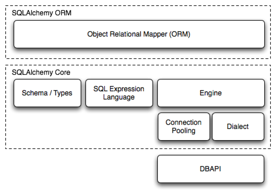

# SQLAlchemy
## 架构


主要分为两层，一层是ORM，一层是Core，ORM基于Core


## 建立连接 引擎
```python
from sqlalchemy import create_engine
engine = create_engine("sqlite+pysqlite:///:memory:", echo=True)
```
"sqlite+pysqlite:///:memory:" 传递。这个字符串指示 Engine 三个重要事实：
1. 在与什么类型的数据库建立连接，这里是`sqlite`
2. 正在使用什么DBAPI，DBAPI是SQLAlchemy用来与特定数据库交互的第三方驱动程序，这里使用的是`pysqlite`
3. 如何定位数据库？`/:memory:`表明我们使用一个内存数据库

## 使用事务和 DBAPI 一起工作
在Engine准备就绪之后，我们要了解其基本操作以及和engine交互的endpoint，`Connection`和`Result`，
我们还将介绍用于这些对象的ORM Facade，即`Session`

> 在使用 ORM 时， Engine 由另一个名为 Session 的对象管理。现代 SQLAlchemy 中的 Session 强调了一个事务性和 SQL 执行模式，这与下面讨论的 Connection 基本相同
### 建立连接
Engine的目的就是为了提供一个Connection，直接使用Core的时候，Connection是与数据库进行所有交互的方式。
由于 Connection 表示针对数据库的开放资源，我们希望始终将对该对象的使用范围限制在特定上下文中，而实现这一目的的最佳方式是使用 Python 上下文管理器形式，也称为 with 语句。
```python
from sqlalchemy import text

with engine.connect() as conn:
    result = conn.execute(text("select 'hello world'"))
    print(result.all())
```
上下文管理器首先为数据库连接提供了支持，并且还将操作限定在事务内部。
Python DBAPI的默认行为就是事务始终是在进行中，也就是说with语句内都是一个事务，当连接的范围被释放时，会发出 ROLLBACK 以结束事务。事务不会自动提交；当我们想要提交数据时，通常需要调用 Connection.commit() ，我们将在下一节中看到

SELECT 的结果也以一个名为 Result 的对象返回，稍后将讨论该对象，但目前我们将补充说明**最好确保此对象在“connect”块内被消耗，并且不要在连接范围之外传递**。

### 提交更改
```python
# "commit as you go"
with engine.connect() as conn:
    conn.execute(text("CREATE TABLE some_table (x int, y int)"))
    conn.execute(
        text("INSERT INTO some_table (x, y) VALUES (:x, :y)"),
        [{"x": 1, "y": 1}, {"x": 2, "y": 4}],
    )
    conn.commit()
```
在块内调用此方法后，我们可以继续运行更多的 SQL 语句，如果选择，我们可以再次调用 Connection.commit() 以进行后续语句。SQLAlchemy 将此风格称为逐步提交。

还有另一种提交数据的风格，即我们可以事先将我们的“connect”块声明为事务块。对于这种操作模式，我们使用 Engine.begin() 方法来获取连接，而不是 Engine.connect() 方法。
```python
# "begin once"
with engine.begin() as conn:
    conn.execute(
        text("INSERT INTO some_table (x, y) VALUES (:x, :y)"),
        [{"x": 6, "y": 8}, {"x": 9, "y": 10}],
    )
```
“一次性开始”风格通常更受青睐，因为它更简洁，并且在一开始就表明了整个块的意图。然而，在本教程中，我们通常会使用“随时提交”风格，因为它对于演示目的更加灵活。

## 语句执行基础
之前的例子已经大概表示了执行语句的过程，首先利用Connection.execute()方法和一个text对象一起，返回一个名为Result的对象

> 这一部分的大部分内容同样适用于ORM，ORM的Session.execute()和Connection.execute()的工作方式非常相似，
> 包括ORM结果行也是通过与Core相同的Result接口传递的。
### 获取行
```python
with engine.connect() as conn:
    result = conn.execute(text("SELECT x, y FROM some_table"))
    for row in result:
        print(f"x: {row.x}  y: {row.y}")
```
Result有许多种获取和转换行的方法，比如之前介绍的Result.all()方法，它返回所有Row对象列表。
它还实现了Python迭代器接口，这样我们可以直接遍历Row对象的集合

Row 对象本身旨在像 Python 命名元组一样运作。下面我们展示了访问行的各种方式。
+ 元祖赋值-这是最符合 Python 风格的方式，即按位置将变量分配给每一行收到的值：
```python
result = conn.execute(text("select x, y from some_table"))

for x, y in result:
    ...
```
+ 整数索引 - 元组是 Python 序列，因此也可以进行常规整数访问：
```python
result = conn.execute(text("select x, y from some_table"))

for row in result:
    x = row[0]
```
+ 属性名称 - 由于这些是 Python 命名元组，元组具有与每列名称匹配的动态属性名称。

这些名称通常是 SQL 语句为每行中的列分配的名称。虽然它们通常是相当可预测的，也可以通过标签进行控制，但在定义较少的情况下，它们可能会受到特定于数据库的行为的影响。
```python
result = conn.execute(text("select x, y from some_table"))

for row in result:
    y = row.y

    # illustrate use with Python f-strings
    print(f"Row: {row.x} {y}")
```
+ 映射访问 - 要将行作为 Python 映射对象接收，这实质上是 Python 对常见 dict 对象的只读接口，可以使用 Result.mappings() 修饰符将 Result 转换为 MappingResult 对象；这是一个产生类似字典的 RowMapping 对象而不是 Row 对象的结果对象：
```python
result = conn.execute(text("select x, y from some_table"))

for dict_row in result.mappings():
    x = dict_row["x"]
    y = dict_row["y"]


#{'x': 1, 'y': 1}
#{'x': 2, 'y': 4}
#{'x': 6, 'y': 8}
#{'x': 9, 'y': 10}
```
### 发送参数
Connection.execute()方法还接收参数，这些参数被称为绑定参数。

为了实现查询y大于某一个值的逻辑，我们首先在text()语句中使用冒号格式“:y"来接收参数，
而其实际的值是通过一个字典，作为execute的第二个参数传递进来的。
```python
with engine.connect() as conn:
    result = conn.execute(text("SELECT x, y FROM some_table WHERE y > :y"), {"y": 2})
    for row in result:
        print(f"x: {row.x}  y: {row.y}")
```
> 在使用文本SQL的时候，注意Python的字面值，甚至非字符串，例如整数或日期，都不应该直接转换成SQL字符串，而是应该使用:y这种站位符，并通过execute方法的第二个参数将值传递进去
> 这是避免SQL注入攻击的最注明的方式。·

### 发送多个参数
之前的例子中，我们执行了一个INSERT语句，看起来我们能一次将多行插入。我们可以通过传递一个字典列表，向Connection.exectue()方法发送多个参数集，
方法将为每一个参数集调用一次SQL语句，这种执行方式称为：executemany
```python
with engine.connect() as conn:
    conn.execute(
        text("INSERT INTO some_table (x, y) VALUES (:x, :y)"),
        [{"x": 11, "y": 12}, {"x": 13, "y": 14}],
    )
    conn.commit()
```
“execute”和“executemany”之间的一个关键行为差异是，后者不支持返回结果行，即使语句包括 RETURNING 子句。唯一的例外是在使用 Core insert() 构造时，该构造稍后在本教程的“使用 INSERT 语句”部分中引入，该构造还使用 Insert.returning() 方法指示 RETURNING。在这种情况下，SQLAlchemy 利用特殊逻辑重新组织 INSERT 语句，以便在支持 RETURNING 的同时为多行调用它。
## 使用ORM会话执行
在使用orm的时候，基本的事务/数据库交互对象被称为Session，在现代的SQLAlchemy中，这个对象的使用方式与Connection非常相似，实际上，当Session被使用时，它内部引用一个Connection来发出SQL

当Session和非ORM结合使用的时候，它会执行我们提供的SQL语句，并且通常不会与Connection直接执行有什么太大不同，所以我们之前用的文本SQL也能和Session结合使用。

Session有几种不同的创建模式，最基本的还是和Connection一直，也就是在上下文处理器中创建
```python
from sqlalchemy.orm import Session

stmt = text("SELECT x, y FROM some_table WHERE y > :y ORDER BY x, y")
with Session(engine) as session:
    result = session.execute(stmt, {"y": 6})
    for row in result:
        print(f"x: {row.x}  y: {row.y}")
```
使用Connection和Session的区别在于：
1. 创建Connection的时候，是`with engine.connect() as conn`
2. 创建Session的时候，需要先import，之后`with Session(engine) as session`

此外，与 Connection 一样， Session 也采用“边提交边执行”行为，使用 Session.commit() 方法，如下所示，使用文本 UPDATE 语句来修改我们的一些数据：
```python
with Session(engine) as session:
    result = session.execute(
        text("UPDATE some_table SET y=:y WHERE x=:x"),
        [{"x": 9, "y": 11}, {"x": 13, "y": 15}],
    )
    session.commit()
```
> Session 在结束事务后实际上并不保留 Connection 对象。下次需要执行数据库 SQL 时，它会从 Engine 获取一个新的 Connection 。

# 使用数据库元数据进行工作
随着我们学习了使用engine和SQL来执行，我们需要开始准备一些Alchemy，SQLAlchemy Core和ORM的中心元素是SQL Expression Language，它允许流畅、可组合地构建 SQL 查询。
这些查询的基础是代表数据库概念（如表和列）的 Python 对象。这些对象被统称为数据库元数据。

在 SQLAlchemy 中，用于数据库元数据的最常见的基础对象被称为 MetaData ， Table 和 Column 。下面的部分将说明这些对象在面向 Core 风格和面向 ORM 风格中的使用方式。

## 使用Table对象设置元数据
在使用关系型数据库的时候，，数据库中我们查询的基本数据来自于表（table），在SQLAlchemy中，数据库中的表，由一个同名的Python对象Table表示。

要开始使用SQLAlchemy表达式语言，首先需要构建Table对象，这些对象代表我们感兴趣的所有数据库表。Table是通过编程方式创建的。
1. 可以直接使用Table构造函数
2. 也可以间接的使用ORM映射类
3. 还有一种，可以从现有数据库中加载一些所有表信息，称为反射

无论使用哪种方法，我们始终从一个集合开始，这将是我们放置Table的地方，称为 MetaData 对象。该对象本质上是围绕一个 Python 字典的Facade，该字典存储了一系列 Table 对象，这些对象以它们的字符串名称为键。虽然 ORM 提供了一些选项来获取这个集合，但我们始终有直接制作一个的选项，看起来像：
```python
from sqlalchemy import MetaData
metadata_obj = MetaData()
```
一旦我们有一个 MetaData 对象，我们就可以声明一些 Table 对象。本教程将从经典的 SQLAlchemy 教程模型开始，其中有一个名为 user_account 的表，例如，存储网站用户，以及一个相关的表 address ，它存储与 user_account 表中的行关联的电子邮件地址。当完全不使用 ORM 声明模型时，我们直接构造每个 Table 对象，通常将每个分配给一个变量，这将是我们在应用程序代码中引用表的方式：
```python
from sqlalchemy import Table, Column, Integer, String
user_table = Table(
    "user_account",
    metadata_obj,
    Column("id", Integer, primary_key=True),
    Column("name", String(30)),
    Column("fullname", String),
)
```
通过上面的例子，当我们希望编写引用数据库中 user_account 表的代码时，我们将使用 user_table Python 变量来引用它。

> 在代码中什么时候创建一个MetaData对象
>
> 最常见的情况就是在整个应用中，只有一个MetaData对象，通常表现为应用程序中的一个模块级变量。通常在“models”或“dbschema”类型的包中的一个地方。
> 
> 还有一个非常常见的用法，MetaData通过ORM中心注册或者Declarative Base这个类来获取，以便这个相同的 MetaData 在 ORM 和核心声明的 Table 对象之间共享。
> 
> 可以有多个 MetaData 集合； Table 对象可以引用其他集合中的 Table 对象，没有限制。然而，对于彼此相关的 Table 对象组，实际上更加简单的做法是将它们设置在单个 MetaData 集合中，无论是从声明它们的角度，还是从 DDL（即 CREATE 和 DROP）语句按正确顺序发出的角度来看。

### Table的组成部分
Python编写的Table结构与SQL CREATE TABLE语句类似，从表名开始，之后列出每一个列，其中每个列都有名称和类型
+ Table - 代表一个数据库表，并将自己分配给一个MetaData集合
+ Colunm - 表示数据库表中的一列，并将其分配给一个Table对象， Column 通常包括一个字符串名称和一个类型对象。要想从Table来访问相关的列，可以通过Table中的关联数据Table.c来访问：
```python
user_table.c.name

user_table.c.keys()
```
Integer ， String - 这些类代表 SQL 数据类型，可以传递给一个 Column ，无论是否被实例化。在上面的例子中，我们想要给“name”列一个长度为“30”，所以我们实例化了 String(30) 。但对于“id”和“fullname”，我们没有指定这些，所以我们可以直接发送类本身。

在即将到来的部分中，我们将说明 Table 的一个基本功能，即在特定数据库连接上生成 DDL。但首先我们将声明第二个 Table 。

### 声明简单约束条件
在示例 user_table 中，第一个 Column 包括 Column.primary_key 参数，这是一种简写技术，表示这个 Column 应该是这个表的主键的一部分。主键本身通常是隐式声明的，并由 PrimaryKeyConstraint 构造表示，我们可以在 Table 对象的 Table.primary_key 属性上看到：
```python
user_table.primary_key
PrimaryKeyConstraint(Column('id', Integer(), table=<user_account>, primary_key=True, nullable=False))
```
最常明确声明的约束是 ForeignKeyConstraint 对象，该对象对应于数据库外键约束。当我们声明彼此相关的表时，SQLAlchemy 不仅使用这些外键约束声明的存在，以便将它们发出到数据库中的 CREATE 语句中，还用于帮助构建 SQL 表达式。

涉及目标表上仅一个列的 ForeignKeyConstraint 通常使用列级速记符号表示，通过 ForeignKey 对象。下面我们声明一个第二个表 address ，它将具有一个外键约束，引用 user 表：
```python
from sqlalchemy import ForeignKey
address_table = Table(
    "address",
    metadata_obj,
    Column("id", Integer, primary_key=True),
    Column("user_id", ForeignKey("user_account.id"), nullable=False),
    Column("email_address", String, nullable=False),
)
```
上表还包括第三种约束条件，在 SQL 中是“NOT NULL”约束条件，以上使用 Column.nullable 参数表示。

在下一部分，我们将发出 user 和 address 表的完成 DDL，以查看完成的结果。

### 将DDL发送到数据库
我们已经创建了两个表示数据库表的对象，从根 MetaData 对象开始，然后进入两个 Table 对象，每个对象都保存着 Column 和 Constraint 对象的集合。
这个对象结构将成为我们未来在 Core 和 ORM 中执行大多数操作的核心。

我们可以使用这个结构的第一个有用的功能是发出 CREATE TABLE 语句，或 DDL，到我们的 SQLite 数据库，以便我们可以向其中插入和查询数据。我们已经拥有完成这些操作所需的所有工具，通过在我们的 MetaData 上调用 MetaData.create_all() 方法，将指向目标数据库的 Engine 发送给它：
```python
metadata_obj.create_all(engine)
2024-05-27 14:50:06,962 INFO sqlalchemy.engine.Engine BEGIN (implicit)
2024-05-27 14:50:06,971 INFO sqlalchemy.engine.Engine PRAGMA main.table_info("user_account")
2024-05-27 14:50:06,971 INFO sqlalchemy.engine.Engine [raw sql] ()
2024-05-27 14:50:06,974 INFO sqlalchemy.engine.Engine PRAGMA temp.table_info("user_account")
2024-05-27 14:50:06,974 INFO sqlalchemy.engine.Engine [raw sql] ()
2024-05-27 14:50:06,976 INFO sqlalchemy.engine.Engine PRAGMA main.table_info("address")
2024-05-27 14:50:06,976 INFO sqlalchemy.engine.Engine [raw sql] ()
2024-05-27 14:50:06,976 INFO sqlalchemy.engine.Engine PRAGMA temp.table_info("address")
2024-05-27 14:50:06,976 INFO sqlalchemy.engine.Engine [raw sql] ()
2024-05-27 14:50:06,987 INFO sqlalchemy.engine.Engine 
CREATE TABLE user_account (
	id INTEGER NOT NULL, 
	name VARCHAR(30), 
	fullname VARCHAR, 
	PRIMARY KEY (id)
)
2024-05-27 14:50:06,987 INFO sqlalchemy.engine.Engine [no key 0.00027s] ()
2024-05-27 14:50:06,990 INFO sqlalchemy.engine.Engine 
CREATE TABLE address (
	id INTEGER NOT NULL, 
	user_id INTEGER NOT NULL, 
	email_address VARCHAR NOT NULL, 
	PRIMARY KEY (id), 
	FOREIGN KEY(user_id) REFERENCES user_account (id)
)
2024-05-27 14:50:06,990 INFO sqlalchemy.engine.Engine [no key 0.00022s] ()
2024-05-27 14:50:06,991 INFO sqlalchemy.engine.Engine COMMIT
```
上述 DDL 创建过程包括一些 SQLite 特定的 PRAGMA 语句，用于在发出 CREATE 之前测试每个表的存在性。完整的步骤系列也包含在 BEGIN/COMMIT 对中，以适应事务性 DDL。

创建过程还负责按正确顺序发出 CREATE 语句；在上面，外键约束取决于 user 表的存在，因此 address 表是第二个创建的。在更复杂的依赖情况下，外键约束也可以使用 ALTER 在事后应用于表。

MetaData 对象还具有一个 MetaData.drop_all() 方法，该方法将以与发出 CREATE 相反的顺序发出 DROP 语句，以便删除模式元素。

> 迁移工具通常是合适的
> 
> 总的来说， MetaData 的 CREATE / DROP 功能对于测试套件、小型和/或新应用程序以及使用短期数据库的应用程序非常有用。然而，长期管理应用程序数据库架构时，像 Alembic 这样的架构管理工具可能是更好的选择，因为它可以管理和协调随着应用程序设计变化而逐渐改变固定数据库架构的过程。

## 使用ORM声明形式来定义表元数据
> 创建表对象的另一种方法
> 
> 前面的例子直接使用了Table对象，这是SQLAlchemy在构建SQL表达式时最终引用数据库表的基础。正如前面提到的，SQLAlchemy ORM提供了一个围绕Table声明过程的Facade，称为Declarative Table。
> Declarative Table 过程实现了与我们在前一节中所做的相同目标，即构建 Table 对象，但在该过程中还提供了另一个称为 ORM 映射类或“映射类”的东西。映射类是在使用 ORM 时最常见的基础单元，在现代的 SQLAlchemy 中，也可以与 Core-centric 使用非常有效地结合使用。
> 
> 使用声明式Table的好处
> 
> 使用更简洁和符合 Python 风格的方式设置列定义，其中可以使用 Python 类型来表示数据库中要使用的 SQL 类型
> 
> 生成的映射类可用于形成 SQL 表达式，在许多情况下保留了由静态分析工具（如 Mypy 和 IDE 类型检查器）捕获的 PEP 484 类型信息
> 
> 允许一次性声明表元数据和 ORM 映射类，用于持久化/对象加载操作。

在使用 ORM 时，我们声明 Table 元数据的过程通常与声明映射类的过程结合在一起。映射类是我们想要创建的任何 Python 类，然后该类将具有与数据库表中的列相关联的属性。虽然有几种实现方式，但最常见的风格被称为声明式，它允许我们同时声明我们的用户定义类和 Table 元数据。

### 创建Declarative Base
在使用 ORM 时， MetaData 集合仍然存在，但它本身与一个通常被称为Declarative Base的仅 ORM 构造相关联。获取新的Declarative Base的最便捷方式是创建一个继承 SQLAlchemy DeclarativeBase 类的新类：
```python
from sqlalchemy.orm import DeclarativeBase
class Base(DeclarativeBase):
    pass
```
以上， Base 类是我们将称之为Declarative Base。当我们创建新的类作为 Base 的子类时，结合适当的类级指令，它们将在类创建时分别被建立为一个新的 ORM 映射类，每个类通常（但不仅限于）指向特定的 Table 对象。

声明基类有引用一个MetaData，它是为我们自动创建的，假设我们没有从外部提供。这个 MetaData 集合可以通过 DeclarativeBase.metadata 类级属性访问。当我们创建新的映射类时，它们每个都将引用这个 MetaData 集合中的一个 Table :
```python
Base.metadata
MetaData()
```
声明基类还引用了一个名为registry的集合，它是SQLAlchemy ORM中的中心“mapper configuration”单元。虽然很少直接访问，但这个对象映射器配置过程至关重要，因为一组ORM映射类将通过这个registry相互协调。
与 MetaData 一样，我们的声明基类还为我们创建了一个 registry （再次提供传递我们自己的 registry 的选项），我们可以通过 DeclarativeBase.registry 类变量访问：
```python
Base.registry
<sqlalchemy.orm.decl_api.registry object at 0x00000225021B71D0>
```
> 使用registry进行映射的其他方法
> 
> DeclarativeBase 不是映射类的唯一方式，只是最常见的一种。 registry 还提供其他映射配置模式，包括基于装饰器和命令式的类映射方式。同时还完全支持创建 Python 数据类。有关详细信息，请参阅 ORM 映射类配置的参考文档。

